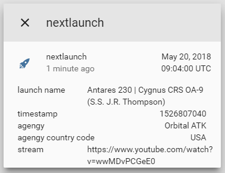

# sensor.launchlibrary [](https://travis-ci.com/custom-components/sensor.launchlibrary)

A platform which allows you to get information from alerts.weather.gov.
  
To get started put `/custom_components/sensor/launchlibrary.py` here:  
`<config directory>/custom_components/sensor/launchlibrary.py`  
  
**Example configuration.yaml:**

```yaml
sensor:
  platform: launchlibrary
```

**Configuration variables:**  
  
key | description  
:--- | :---  
**platform (Required)** | The platform name.  
  
## Sample overview


  
[Home-Assistant demo site.](https://ha-test-launchlibrary.halfdecent.io)

This platform is using the [launchlibrary.net](http://launchlibrary.net/) API to get the information.  
***
Due to how `custom_componentes` are loaded, it is normal to see a `ModuleNotFoundError` error on first boot after adding this, to resolve it, restart Home-Assistant.